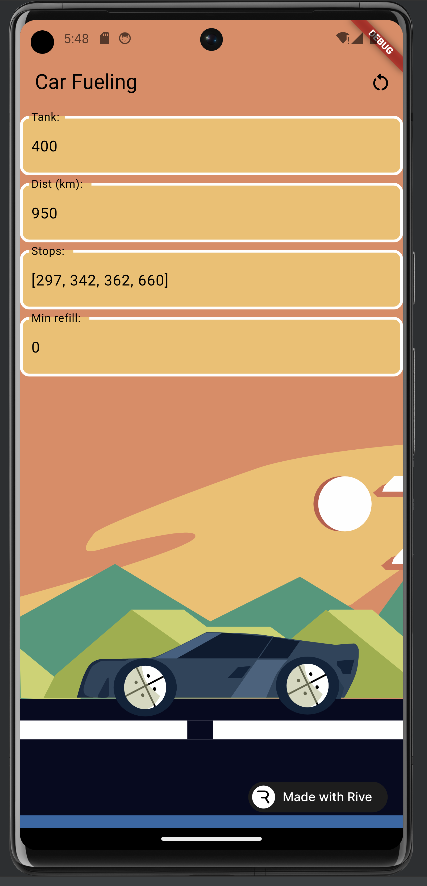

# 10º Workshop - Flutter Wars: Dominando o lado escuro do TDD com o poder do Bloc

> "Clean code that works, in Ron Jeffries' pithy phrase, is the goal of Test-Driven Development" - Test-Driven Development by Example, Kent Beck

## O que é TDD?

É uma abordagem de desenvolvimento de Software em que os Teste são escritos antes do código de produção.

O processo geralmente segue três passos:

1. Escrever um teste (Red);
2. Escrever um código de produção (Green);
3. Refatorar o código (To-Red);

## O que é Bloc?

Uma biblioteca de gerenciamento de estado previsível que ajuda a implementar o padrão de design BLoC.

## Projeto

### Car Fueling

CarFueling é um aplicativo com o objetivo de auxiliar o motorista indicando a melhor rota para abastecimento de tanque de casolina saindo do ponto de origem A até o ponto de destino B.

### Caso de uso

Como um usuário quero saber o número mínimo de reabastecimentos de tanques de gasolina para ir de uma cidade a outra.

#### alternativa

Se não for possível chegar ao destino, me avise com um alerta e interrompa a navegação guiada.

[Github: Car Fueling](https://github.com/eniltonangelim/car_fueling.git)

Ilustrado e animado por Enilton Angelim

## Bibliografia

- [Test-Driven Development by Example - Kent Beck](https://www.amazon.com/Test-Driven-Development-Kent-Beck/dp/0321146530/ref=tmm_pap_swatch_0?_encoding=UTF8&qid=&sr=)
- [Bloc - a predictable state management library for Dart](https://bloclibrary.dev/#/)
- [Algorithmic Toolbox - UC San Diego](https://www.coursera.org/learn/algorithmic-toolbox)